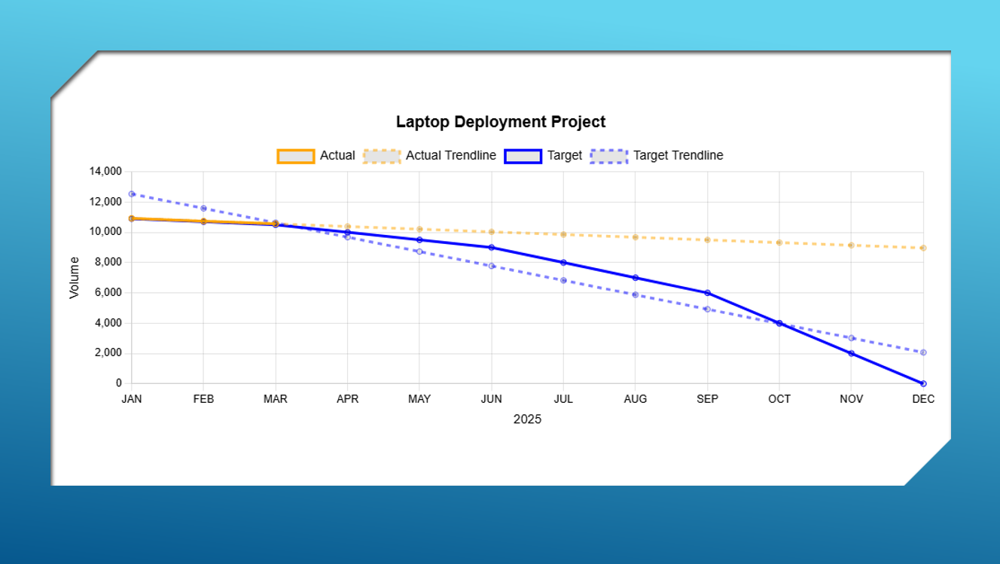
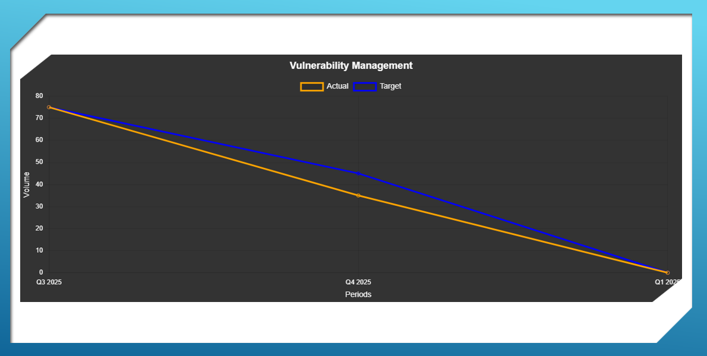

# Glidepath

Generate free quick and easy charts for tracking burndown, deployments, glidepaths, or creating line charts.

Charts can be generated in Light or Dark Mode, with or without trendlines for Target or Actuals.

Usage. Load the index.html file with the styles.css file in the same folder, from desktop or from a web server.

Enjoy.
